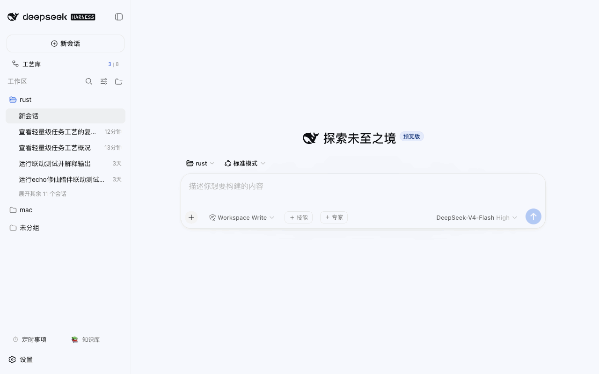

# @weibaohui/dsh-process

[](https://github.com/topics/dsh-plugin)
[](https://www.npmjs.com/package/@weibaohui/dsh-process)

**工艺管理插件**：把 ntd 的「工艺」（Process，多阶段 · 多环节的 agent 工作流模板）接进 dsh web——浏览、编辑、校验、导入导出、AI 生成，agent 能用工具读工艺库、按工艺分阶段推进。



## 核心功能

- **双库浏览**：我的库（`~/.ntd/processes`，可写）+ 内置库（`~/.ntd/bundled/processes`，只读），递归扫描分类子目录；侧栏入口实时显示「我的 | 内置」计数
- **详情三视图**：概览（元信息 / 限额 / 异常触发 / 诊断清单）、结构（阶段 → 环节树，prompt / 执行器 / 专家 / 技能 / 门禁 / 流转全字段展示）、YAML（行号 + 着色，诊断点击跳行高亮）
- **编辑器**：行号 + 边写边校验（300ms 防抖），错误阻止保存、警告只黄标；`⌘/Ctrl+S` 保存；**乐观锁**——外部（ntd 或其他编辑器）改过文件会 409，给「重新加载 / 仍然覆盖」二选一
- **校验器**：语法错 / 缺 name / phases 空 / 环节 id 重复 / `on_gate_fail` `goto:` 指向不存在的环节 = 错误；缺 guid、未知专家/技能引用（对照专家库、技能库）、未知键 = 警告
- **全套 CRUD**：新建（带注释骨架）/ 复制内置到我的库（自动换 guid，注释与未知字段保留）/ 重命名 / 删除（移入 `.trash`）
- **导入导出**：多文件导入（重名可选覆盖，逐文件报结果）、单个 yaml 下载、全库 zip
- **实时同步**：fs.watch 两个根目录 → SSE 变更帧 → 界面秒级刷新，ntd 那边改了这边立刻看到
- **⚡ AI 生成工艺**：输入需求 + 复杂度 → 真实 agent 会话产出一版工艺 YAML → 校验 → 预览确认 → 写入我的库
- **agent 协作**：`process_list` / `process_get` / `process_validate` / `process_save` 四个工具 + systemPrompt 段（按工艺推进：一环节一交付、门禁不过按 `on_gate_fail` 流转）；内置库对 agent 同样只读
- **不发明格式**：100% 复用 ntd 工艺 YAML，编辑走 Document API，注释、键序、未知字段往返不丢

## 安装

```bash
dsh plugin --profile web add @weibaohui/dsh-process
```

装完重启 `dsh web` 并刷新页面，侧栏「新会话」下方出现「工艺」入口即成功。零配置：默认读写 ntd 的工艺目录，也可在 ⚙ 设置里改根目录、扫描深度、是否校验专家/技能引用。

## 使用

1. 点侧栏「工艺」打开全屏工艺库（侧栏保持可点；`Esc`、点击会话行、打开任务看板都会自动关闭；与任务看板互斥）
2. 左列选工艺，右侧概览 / 结构 / YAML 三个 tab 查看；`↑↓` 键盘切换
3. 「✎ 编辑」进 YAML 编辑器，边写边校验，`⌘S` 保存；内置库条目显示「⧉ 复制到我的库」
4. 「+ 新建 ▾」空白工艺（带注释骨架）或复制现有；「⬆ 导入」支持拖拽多文件；「⬇ 导出」单文件或全库 zip
5. 「⚡ AI 生成」：描述需求，AI 产出 → 校验 → 预览 → 写入
6. 任意会话里让 agent 干活：`按工艺 lightweight-task 执行这个需求` / `用 process_save 把这套流程存成工艺`

## 数据与安全

- 工艺文件本身就是数据源（无独立数据库）；所有写路径只针对我的库，内置库一律 403
- 路径白名单：拒绝 `..`、绝对路径、点目录；删除先进 `.trash`（列表隐藏，可手工找回）
- 根目录等配置走 dsh settings 服务（`dsh-process` 命名空间），会随 dsh-sync 同步

## 开发

```bash
npm install
npm test            # host 单测（校验器 / 存储 CRUD / 工具 / 错误映射）
npm run build:client
npm run check
```

`link:` 方式安装到 web profile 后，改 `client/index.js` 跑 `npm run build:client` 刷新即生效；host 侧改动需重启 `dsh web`。

## 路线

- v0.2：按工艺驱动执行（开 dsh 会话逐环节跑、执行台账、执行看板）、结构化表单编辑、回收站恢复 UI、工艺市场

## 联系我 :飞书群


